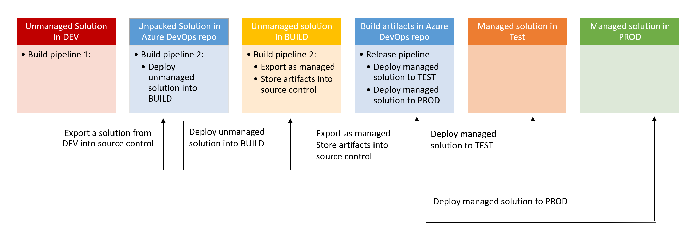

# Application Lifecycle Management for Power Platform

## Why would we care?

There are several issues with a one-environment strategy, not logging all code to source contrl and not automating the build process for solutions in environments.

* we operate at open heart when developing solutions while users keep using them
* we can't roll back to previous versions
* code only exists as opaque zip files in an environment

To mitigate risks that come along with these issues, its a good idea to

* log all code into source control
* move solutions across separated environments
* have an automated process for that

## How do we care?

### Basics

* All components are packaged and distributed across environments using solutions
* 2 types of solutions
  * unmanaged:
    * collection of references to components
    * no restrictions on what can be added, removed, or modified
    * recommended only during development of the soluition
  * managed:
    * Components can't be added or removed or modified
    * cannot be exported
    * Recommended when a solution is not actively being customized
* Source control should be your source of truth for storing and collaborating on your components

### Azure DevOps Build Tools for Power Platform

* Azure DevOps Pipelines automatically builds code projects and ship it to any target
* Support both GitHub and Azure repos
* Azure DevOps Build Tools for Power Platform are a collection of build and release tasks related to Power Platform

### Overview of environments

* **DEV** - only for development purposes, only developers and maintainers have access to it
* **BUILD** - only used to store the exported unmanaged solution and export it as managed solution (this separates the solution from the solution that is currently and ongoing developed in **DEV**)
* **TEST** - only for User Acceptance Testing - A subset of enduser can test functionality of this release.
* **PROD** - production use of apps in the organization

### Process of building and releasing versions

Every new feature, all bug fixes are implemented in **DEV**. Once the release passed the technical tests in **DEV**, it is build in **BUILD** and then finally released to **TEST**, where endusers can try out and test the release. If they approve it, the release gets published to **PROD**. If they don't approve it, development starts again in DEV and bug fixes/features get implemented in the next sprint.