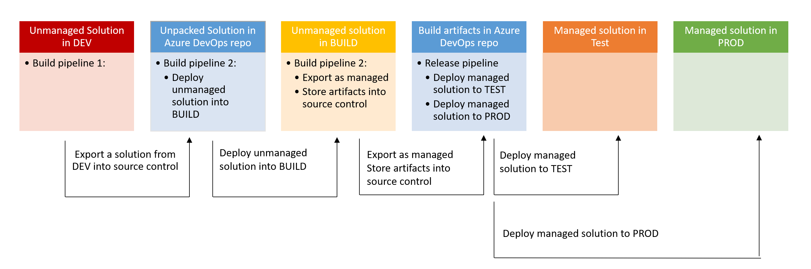

# Setup ALM

## Setup your Azure DevOps organization

* Open [dev.azure.com](https://dev.azure.com)
* Create a new organization
* Create a new project
* Create a repository to hold your code
* Optional, but a good idea: clone this repo so you can work locally
* Optional, but also a good idea: invite co-worker to the project
* Open **Project Settings** (lower left corner) --> **Repositories** --> **Security** and select **Contribute** permissions for **Project Collection Service Accounts** and <ProjectName> Build Service <OrgName>

## Create an app registration

* Open [portal.azure.com](https://portal.azure.com)
* Select **Azure Active Directory**
* Select **App registrations** --> **New app registration**
* Give it a name, select **Register**
* Select **Certificates and secrets**, create a secret, take note of it.
* Also copy the values of the **app id** and **tenant id** - we need them later.

## Create environments

AS a first step, we need to ensure that we have all environments in place:

* Open [aka.ms/ppac](https://aka.ms/ppac)
* Create environments for DEV, BUILD, TEST, PROD - make sure all of them have a Dataverse database

## Create an Application user

Now we need to make sure that we create an Application user in all of our 4 environments.

* Open [aka.ms/ppac](https://aka.ms/ppac)
* Select your environment
* Select **Settings**
* Select **Application users** under **Users & permissions**
* Select **new app users**
* Select **add an app**
* Select the default business unit
* Select the pen icon next to **Security roles** and add the **System Administrator** role
* Select **Save**
  
Remember to this for all environments!

## Create Service connections in Azure DevOps

* Return to Azure DevOps, select **Project settings** --> **Pipelines** --> **Service connections**
* Select **new service Connection**
* Select **Power Platform**
* Select **Application Id and secret** as authentication method
* Obtain the **Instance URL** from your **DEV** environment:
  * Open [make.powerapps.com](https://make.powerapps.com)
  * Select te **DEV** environmet
  * Select the gear icon in the top right corner
  * Select Settengs, copy the **Instance URL**
* Paste this value to **Server URL**
* Paste **Tenant id**, **App id**, and **App secret** from your app registration ito the respective fields
* Save the connection under name **DEV Service Principal**
* Repeat this steps for **BUILD**, **TEST**, and **PROD**

## Create pipeline 1

Remember pipeline 1?

Objective is to export a solution from **DEV** into source control (Azure DevOps repos)

* Select **Pipelines** --> **New Pipeline** --> **Use the Classic Editor**
* Select the Source as **Azure Repos Git**, select your Project, Repository and Branch and select **continue**
* Select **Start with empty job**
* Select **Agent Job 1** and check **Allow Scripts to access OAuth token**
* Add task **Power Platform Tool Installer**
* Add task **Power Platform Export Solution**
* As **Service Connection** select **Dev Service Principal**
* Provide the solution name (not the displayName) and the folder for the output - select the ... menu for that. You can also use variable for that.
* Uncheck the **Export as Managed solution** checkmark
* 