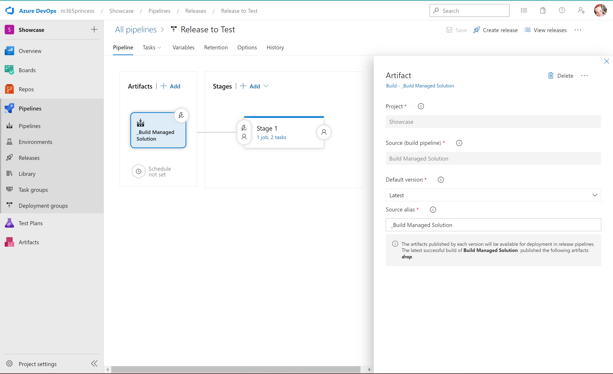

# ALM

## Preparation

### Setup your Azure DevOps organization

* Open [dev.azure.com](https://dev.azure.com)
* Create a new organization
* Create a new project
* Create a repository to hold your code
* Optional, but a good idea: Clone this repo so you can work locally in VS Code
* Optional, but also a good idea: invite co-workers to the project
* Open **Project Settings** (lower left corner) --> **Repositories** --> **Security** and select **Contribute** permissions for both (!)
  * **Project Collection Service Accounts**


  
  * **<ProjectName> Build Service <OrgName>**


### Create an app registration

* Open [portal.azure.com](https://portal.azure.com)
* Select **Azure Active Directory**
* Select **App registrations** --> **New app registration**
* Give it a name, select **Register**
* Select **Certificates and secrets**, create a secret, take note of it. (No I mean for real - you will not be able to se the value again if you navigate away.)
* Also copy the values of the **App id** and **Tenant id** - we need them later.

If you think that you should grant API permissions for Dynamics CRM -> user_impersonation, please don't be fooled. This is not necessary, as access to Dataverse exclusively handled by Security Roles. You can read more about it in this blog post:

[Why your Power Platform service principal doesn't need a Dynamics user_impersonation scope](https://www.m365princess.com/blogs/2022-07-25-why-your-service-principal-doesnt-need-a-dynamics-user_impersonation-scope/)

### Create environments

AS a first step, we need to ensure that we have all environments in place:

* Open [aka.ms/ppac](https://aka.ms/ppac)
* Create environments for **DEV**, **BUILD**, **TEST**, **PROD** - make sure all of them have a Dataverse database

### Create an Application user

Now we need to make sure that we create an Application user in all of our 4 environments.

* Open [aka.ms/ppac](https://aka.ms/ppac)
* Select your environment
* Select **Settings**
* Select **Application users** under **Users & permissions**
* Select **new app users**
* Select **add an app**
* Select the app registration from Azure Active Directory
* Select the default business unit
* Select the pen icon next to **Security roles** and add the **System Administrator** role
* Select **Save**
  
Remember to do this for all environments!

### Create Service connections in Azure DevOps

* Return to Azure DevOps, select **Project settings** --> **Pipelines** --> **Service connections**
* Select **new service Connection**
* Select **Power Platform**
* Select **Application Id and secret** as authentication method
* Obtain the **Instance URL** from your **DEV** environment:
  * Open [make.powerapps.com](https://make.powerapps.com)
  * Select te **DEV** environment
  * Select the gear icon  ⚙️ in the top right corner
  * Select **Settings**, copy the **Instance URL**
* Paste this value to **Server URL**
* Paste **Tenant id**, **App id**, and **App secret** from your app registration ito the respective fields
* Save the connection under name **DEV Service Principal**
* Repeat this steps for **BUILD**, **TEST**, and **PROD**

## Create Build pipeline 1 - Export from DEV

Remember Build pipeline 1?


Objective is to export a solution from **DEV** into source control (Azure DevOps repos)

* Select **Pipelines** --> **New Pipeline** --> **Use the Classic Editor**
* Select the Source as **Azure Repos Git**, select your Project, Repository and Branch and select **continue**
* Select **Start with empty job**
* Select **Agent Job 1** and check **Allow Scripts to access OAuth token**
* Add task **Power Platform Tool Installer**
* Add task **Power Platform Export Solution**
* As **Service Connection** select **Dev Service Principal**


* Provide the solution name (not the displayName) and the folder for the output - select the ... menu for that. You can also use variable for that.


* Uncheck the **Export as Managed solution** checkmark
* Add task **Power Platform Unpack solution**
* Specify Input file (its the output file location from previous task)
* Specify target folder to output th unpacked files (can sit at the root of the project  - use the **...** menu)


* Add a task **Command Line script**, and paste the below script

```bash
echo commit all changes
git config user.email “<your git email>”
git config user.name "<your git user name>"
git checkout -B main
git add --all
git commit -m "code commit"
git push --set-upstream origin main
```

* Save and queue the pipeline and wait for it to run successfully

## Create Build pipeline 2 - Build Managed Solution

Now onto buiding pipeline 2


Objective here is to deploy the unmanaged solution to our **BUILD** environment, so that we can still continue to modify code in **DEV**.


* Add tasks
  * Power Platform Tool Installer
  * Power Platform Pack Solution
  * Power Platform Import Solution
  * Power Platform Export Solution
  * Publish Artifact drop

### Power Platform Pack Solution

This task will pack the unpacked files that are currently sitting in **DEV** as an unmanaged solution:


### Power Platform Import Solution

This task will now import the unmanaged solution into our **BUILD** environment.


### Power Platform Export Solution

This task exports the solution as a managed solution:


### Publish Artifact Drop

As a last step, we will now publish the build artifacts


## Release pipeline to TEST

Now that we have our managed solution in the **BUILD** environment, we will want to release it to **TEST** or to **PROD** (depends on requirements of User Acceptance Testing)


* Under **Pipelines**, select **Releases**
* Under Artifacts, select your project and the source (its the Build pipeline 2  - Build Managed Solution)



* For Stage 1, add 2 tasks
  * Power Platform Tool Installer
  * Power Platform Import Solution


* Create a Release
* Deploy the Release

## Release pipeline to PROD

Create another Release pipeline for **PROD**

## Process of CI/CD

The process of Continous Improvement/Continous Deployment (CI/CD) describes how we can now iterate in a secure way to improve our app, while making sure that users are not affected by changes happening in **DEV**, have the chance to exactly test in **TEST** what they will get in **PROD** and developers can feel at ease as all code is stored in source control and commits can be easily tracked.

For our **Build pipeline 2  - Build Managed Solution** we can turn on a setting **enable continous integration** which means, that everytime, we push code to our main branch this job runs and builds a Managed solution in **BUILD**.

We do push code to our main branch by letting our **Build pipeline 1  - Export from DEV** run 💡 - which we trigger manually in Azure Devops.


For the Release pipeline, there is a similar setting:


Once it is enabled, it triggers automatically, if a new Build is available, aka when our **Build pipeline 2  - Build Managed Solution** ran successfully. This means, that with these settings being switched on, we start a chain reaction everytime, we run **Build pipeline 1 - Export from DEV** - and it results in a new release of a managed solution in TEST.

Users can now do the user acceptance training, log experienced issues or change requests for the next release and then we can manually trigger the **Release to PROD** pipeline so that we export the solution to the **PROD** environment. In case of severe issues with the relase, which only get discovered during user acceptance testing, release to **PROD** will be deferred, changes to the app are being addressed in **DEV**, and then the pipelines are triggered again manually to run the entire process again.
